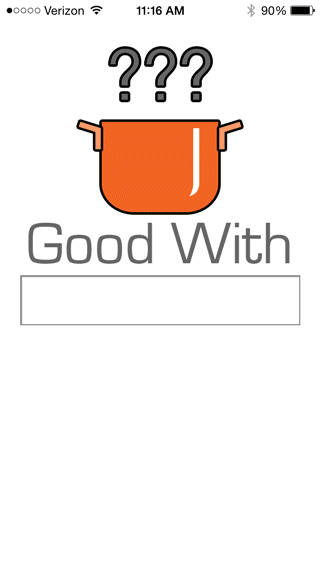

GoodWith was my second app.  I wanted to build an app that would show me ingredients that appear on recipes with another ingredient.  What's good with squid ink?  The results include recipes with the ingredients.  While not available for download, the source code is available on my github.  The main objectives with this app were:

- construct a database from raw data
- experiment with different database types (XML, plist, SQLite)
- establish url connections and parse data
- utilize multithreading for performance optimization
- improve user interface design

Source Code Available.